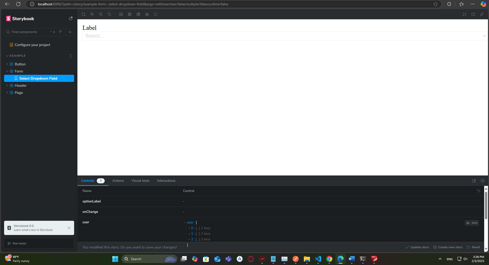

<h1 align="center">
  <a href="https://github.com/Alamnzr123/quiz-storybook">
  Storybook Application - Form Component
  </a>
  <br />
</h1>



**Storybook Application - Form Component** is application that helps you build UI components isolated from the business logic using **Vite**.
Simple & light is designed to provide all the basic components using the `sx` prop for a developer need to create form.

## Live Demo

Take a look the live demo here 👉 [https://quiz-storybook-static.vercel.app/](https://quiz-storybook-static.vercel.app/)


## Recommended IDE Setup

[VSCode](https://code.visualstudio.com/)

## Customize configuration

See [Vite Configuration Reference](https://vitejs.dev/config/).

## Project Setup

```sh
npm install
```

### Compile and Hot-Reload for Development

```sh
npm run storybook
```

### Compile and Minify for Production

```sh
npm run build-storybook
```

### Run Unit Tests with [Vitest](https://vitest.dev/)

```sh
npm run test:unit
```

### Lint with [ESLint](https://eslint.org/)

```sh
npm run lint
```
